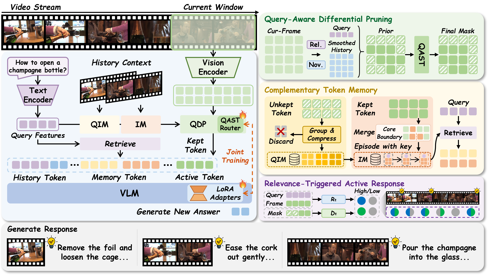
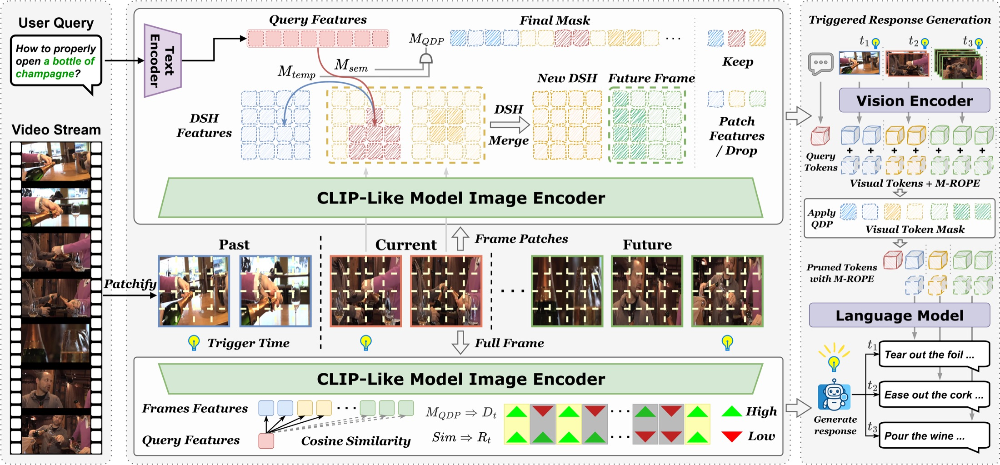

<div align="center">


# QueryStream & QueryStream++

### See what matters. Remember what happened. Respond when it counts.

[\[📖 QueryStream++ Paper (coming soon)\]](https://proceedings.iclr.cc/paper_files/paper/2026/hash/0b17d256cf1fe1cc084922a8c6b565b7-Abstract-Conference.html) [\[📖 QueryStream Paper (ICLR'26)\]](https://proceedings.iclr.cc/paper_files/paper/2026/hash/0b17d256cf1fe1cc084922a8c6b565b7-Abstract-Conference.html) [\[🤖 HF Model\]](https://huggingface.co/KrZhang/QueryStreamPlus)

</div>

[**QueryStream++**](#-querystream-inference) extends [**QueryStream**](#-querystream-inference-1), our ICLR 2026 framework, from single-query understanding over minute-scale video streams to long-horizon multi-turn interaction over hour-scale and potentially unbounded streams. Building on QueryStream's efficient visual pruning and proactive response, QueryStream++ introduces a trainable query-aware router and **Complementary Token Memory (CTM)** to retain complementary evidence in bounded long-term memory throughout causal interaction.

## ✨ At a glance

| | QueryStream++ | QueryStream |
|---|---|---|
| Visual selection | QDP prior refined by a trained query-aware router | Training-free QDP |
| Long-term context | CTM: Query-Independent Memory (QIM) + Interaction Memory (IM) | No dual-path memory |
| Released inference | Causal multi-turn generation | Single-query QDP |
| Released weights | QueryStreamPlus-7B | TimeChat-Online-7B or Qwen2.5-VL-7B-Instruct |
| Semantic encoder | SigLIP2-L/16-256 | OpenCLIP ViT-L/14 |

## 🧠 How it works

The trainable QueryStream++ router refines the QDP relevance and novelty prior, guides attention before pruning, and selects current visual tokens under a fixed budget. CTM then stores complementary evidence on two paths: QIM compresses novel observations not selected for the current query, while IM consolidates selected evidence into temporally linked episodes. At each new question, the model retrieves both kinds of history and combines them with the latest causal video interval.



QueryStream provides the foundation: QDP retains query-relevant and temporally novel evidence, while RTAR determines when a stream warrants a proactive response.



The QueryStream++ implementation is under [`querystream_plus/`](querystream_plus/), while the original QueryStream demo is available under [`querystream/`](querystream/README.md).

## ⚙️ Installation

Clone the repository:

```bash
git clone https://github.com/Zhangkr2003/QueryStreamPlus.git
cd QueryStreamPlus
```

Install the Python dependencies. Requirements: Python >= 3.10 and an NVIDIA GPU with a driver that supports CUDA 12.x.

```bash
python -m pip install -r requirements.txt
python -m pip install flash-attn --no-build-isolation
python -m pip install -e . --no-deps
```

## 🧩 Model layout

Download QueryStreamPlus-7B and SigLIP2:

```bash
bash tools/download_model_weights.sh
```

The script creates the following layout:

```text
models/
├── QueryStreamPlus-7B/
│   ├── config.json
│   ├── model.safetensors.index.json
│   ├── model-00001-of-00004.safetensors
│   ├── ...
│   ├── adapter/
│   │   ├── adapter_config.json
│   │   └── adapter_model.safetensors
│   └── router/
│       └── router.pt
└── siglip2-large-patch16-256/
```

## 🚀 QueryStream++ inference

A session JSON points to a video relative to the JSON file and lists questions in causal time order:

```json
{
  "video": "videos/example.mp4",
  "turns": [
    {"visible_end": 67.0, "query": "What are the characteristics of the appearance of this musical instrument?"},
    {"visible_end": 107.0, "query": "Why can this instrument be precisely tuned?"},
    {"visible_end": 165.0, "query": "What color is the clothing he is wearing?"},
    {"visible_end": 173.0, "query": "What product is being showcased in this video?"}
  ]
}
```

Run the included example:

```bash
bash scripts/infer_multiturn.sh examples/multiturn_session.json
```

Example output:

```text
[67.0s] The drum set is made of metal, with a shiny surface and white drumheads.
[107.0s] Because it has multiple tuning screws on its body.
[165.0s] He is wearing black clothes.
[173.0s] A snare drum.
```

The complete result is saved to `outputs/inference/querystream_plus_result.json`.

The demo uses the 4K visual-context preset by default. Select another released configuration with `VISUAL_BUDGET=2k` or `VISUAL_BUDGET=6k`:

```bash
VISUAL_BUDGET=2k bash scripts/infer_multiturn.sh examples/multiturn_session.json
VISUAL_BUDGET=6k bash scripts/infer_multiturn.sh examples/multiturn_session.json
```

| Preset | Active keep rate | QIM read | IM read |
|---|---:|---:|---:|
| 2K | 0.50 | 512 | 512 |
| 4K (default) | 0.75 | 1024 | 1536 |
| 6K | 0.75 | 2048 | 2560 |

## 🎬 QueryStream inference

The original QueryStream demo supports single-query QDP inference with TimeChat-Online or Qwen2.5-VL. See the [setup and inference guide](querystream/README.md).

## 📊 Evaluation

QueryStream++ supports StreamingBench, OVO-Bench, Video-MME, LongVideoBench, and SVBench. See the [evaluation guide](eval/README.md) for dataset preparation, configuration, and evaluation commands.

## 🛠️ Training QueryStream++

Stage I trains the query-aware router for one epoch on 2 GPUs with eight-step gradient accumulation. Stage II jointly updates the router and rank-16 LoRA adapter for two epochs on 4 GPUs with 16-step gradient accumulation.

Example manifests for both stages are included:

```text
data/training/stage1.jsonl
data/training/stage2.jsonl
data/training/media/
outputs/training/
```

Place the corresponding videos under `data/training/media/`, replace the example manifests with the full training data, and run Stage I:

```bash
bash scripts/train_stage1_router.sh
```

Then run Stage II with the router checkpoint produced by Stage I:

```bash
ROUTER_CHECKPOINT=outputs/training/stage1_router/querystream_router_stepN.pt \
bash scripts/train_stage2_hybrid_mixed.sh
```

## 🗂️ Repository layout

```text
querystream_plus/          QueryStream++ modeling, memory, inference, and training
demo/                      causal multi-turn inference entry point
scripts/                   inference and training launchers
eval/                      five benchmark runners and scoring tools
querystream/               original QueryStream QDP demo
tools/                     model and evaluation-dataset download helpers
third_party/               lmms-eval integration for LongVideoBench
examples/                  multi-turn session example
data/training/             Stage I and Stage II manifest examples
models/                    standard local model layout (weights not tracked by Git)
outputs/                   generated inference, evaluation, and feature outputs
```

## License

QueryStream++ is released under the [Apache License 2.0](LICENSE).

## ♥️ Acknowledgments

We thank the open-source model, library, and benchmark communities that made this project possible, including [SigLIP2](https://huggingface.co/google/siglip2-large-patch16-256), [OpenCLIP](https://github.com/mlfoundations/open_clip), [TimeChat-Online](https://github.com/yaolinli/TimeChat-Online), [lmms-eval](https://github.com/EvolvingLMMs-Lab/lmms-eval), [StreamingBench](https://streamingbench.github.io/), [OVO-Bench](https://github.com/JoeLeelyf/OVO-Bench), [SVBench](https://github.com/sotayang/SVBench), [Video-MME](https://video-mme.github.io/), and [LongVideoBench](https://github.com/longvideobench/LongVideoBench).

## 📝 Citation

If QueryStream helps your research, please cite:

```bibtex
@inproceedings{zhang2026querystream,
  title={QueryStream: Advancing Streaming Video Understanding with Query-Aware Pruning and Proactive Response},
  author={Zhang, Kairui and Yang, Zhenyu and Wang, Bing and Qian, Shengsheng and Xu, Changsheng},
  booktitle={International Conference on Learning Representations},
  year={2026}
}
```
